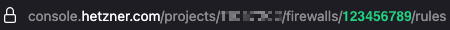

# hcloud-ddns-fw

This tool is a simple microservice which allows you to update your hcloud DNS records and Firewall rules. I built this, because I needed to restrict Firewall rules to specific IPs or networks, which have dynamic IP addresses. So in other words, this is DynDNS updater which can set Firewall rules for dynamic IP addresses too.

Besides this, I alway wanted to learn [Go](https://go.dev/), so I thought this could be a great first project.

## Features

### hcloud DNS

It is possible to update one or more **existing** A or AAAA DNS records from one or more DNS zones. If the specified record does not exist in hcloud DNS, the updater won't add it.

### hcloud Firewall

The Firewall updater doesn't update single Firewall rules. It replaces the whole Firewall. Since you can add multiple Firewalls to a single server, I suggest to add an dedicated Firewall for this updater to the desired resources.
Basically, all Firewall features are supported, except port ranges (at the moment).

- Inbound or outbound
- IPv4 and IPv6
- TCP, UDP, ICMP, GRE or ESP
- Port

## Workflow

1. The updater checks your public IP(s) in a given interval against https://ipify.org
2. An update will be started if a changed IP address is detected

## Configuration

The tool is designed to run in a Docker container. It uses less than 10 MB memory and does not have high CPU peaks. Anyways, you can also build a Go updater running outside a container.

To configure the updater, you will need to customize the [compose.yaml](./compose.yaml) and [config.yaml](./config.yaml) according to your needs. Following configuration options are available.

### DNS

Following structure is required for DNS records:

```yaml
dns-zones:
  - zone-name: example.com   # DNS zone name
    records:
      - type: A              # Record type A or AAAA
        name: test           # Name -> test.example.com
        ttl: 300             # TTL (3600 if not set)
        comment: My comment  # A custom comment (optional)
```

You can use multiple records in multiple different DNS zones.

### Firewall

This structure is required for Firewalls:

```yaml
firewalls:
  - id: 123456789            # hcloud Firewall id
    fw-rules:
      - description: ssh     # Description (optional but recommended)
        direction: in        # Direction in or out
        port: 22             # Port
        protocol: tcp        # Protocol
        ipv4mask: 32         # CIDR for IPv4 address (32 if not set)
        ipv6mask: 64         # CIDR for IPv6 address (128 if not set)
```

You can manage multiple rules on multiple different Firewalls. Also see following topics:

- How to retrieve the Firewall id? -> see below
- [Introduction to CIDR](https://blog.ip2location.com/knowledge-base/a-comprehensive-guide-to-ipv4-and-ipv6-cidr/)

### Docker compose settings

```yaml
services:
  updater:
    image: hcloud-ddns-fw:latest
    network_mode: host
    mem_limit: 16M
    environment:
      HCLOUD_TOKEN: yourSecretHcloudToken
      UPDATE_INTERVAL: 300
      HTTP_TIMEOUT: 30
      IP_MODE: IPv4
      LOGLEVEL: INFO
      TZ: Europe/Berlin
    volumes:
      - ./config.yaml:/app/config.yaml
    restart: on-failure:5
```

#### `HCLOUD_TOKEN:`

hcloud API token. ‼️ **This token is mighty. Handle with care.** ‼️

```bash
HCLOUD_TOKEN: yourSecretHcloudToken
# type: string
```

#### `UPDATE_INTERVAL`

Interval in seconds to check for IP address changes.

```bash
UPDATE_INTERVAL: 300
# type: int
```

#### `HTTP_TIMEOUT`

Timeout for http requests, used for fetching your public IP address and to run updates on hcloud DNS records or Firewalls. Don't set this to low, since the updater will also check for success within the same ongoing period.

```bash
HTTP_TIMEOUT: 30
# type: int
```

#### `IP_MODE`

Select IP mode to be used. Available options are:

- `IPv4` only use IPv4
- `IPv6` only use IPv6
- `Dual` use both IPv4 and IPv6

```bash
IP_MODE: IPv4
# type: string
```

#### `LOGLEVEL`

Log level of the updater. Available options are:

- `ERROR`
- `INFO` default setting
- `DEBUG`

```bash
LOGLEVEL: INFO
# type: string
```

#### `TZ`

Time zone setting. Also see [https://utctime.info/timezone/](https://utctime.info/timezone/).

```bash
TZ: Europe/Berlin
# type: string
```

## How to create a hcloud token

To create a hcloud token, follow the steps as described [here](https://docs.hetzner.com/cloud/api/getting-started/generating-api-token/). The token will require **Read & Write** permissions.

‼️ **This token is mighty. Handle with care.** ‼️

## How to retrieve the Firewall id

### Use a command

Start the Docker container or the Go binary using the following command:

#### `docker run`

```bash
docker run --rm -e HCLOUD_TOKEN=yourSecretHcloudToken ghcr.io/fliprocks/hcloud-ddns-fw:latest list-firewalls
```

#### `docker compose`

```bash
docker compose up -d
docker exec hcloud-ddns-fw-updater-1 /app/hcloud-ddns-fw list-firewalls
docker compose down
```

#### Go binary (you will need to build this first)

```bash
export HCLOUD_TOKEN=yourSecretHcloudToken
./hcloud-ddns-fw list-firewalls
```

### Have a look at [console.hetzner.com](https://console.hetzner.com)

1. Login at hetzner console
2. Navigate to `Firewalls`
3. Click on desired Firewall
4. Check the Browsers URL
   
   The highlighted <b style="color:#22D081;">123456789</b> represents your Firewall id.

## Deploy the services

### Docker compose

The easiest way to deploy the service is using the [compose.yaml](./compose.yaml) and [config.yaml](./config.yaml) from this repository.

```bash
docker compose up -d
```

### Docker run

Alternatively, you can also use the `docker run` command together with a [config.yaml](./config.yaml) file to deploy the service.

```bash
docker run \
   -e HCLOUD_TOKEN=yourSecretHcloudToken \
   -e UPDATE_INTERVAL=300 \
   -e HTTP_TIMEOUT=10 \
   -e IP_MODE=IPv4 \
   -e LOGLEVEL=INFO \
   -e TZ=Europe/Berlin \
   -v ./config.yaml:/app/config.yaml \
   --restart on-failure:5 \
   -m 16M \
   -d \
   ghcr.io/fliprocks/hcloud-ddns-fw:latest
```

### Go binary (without Docker)

There are several ways on how to run the service without Docker. One might be following solution:

```bash
export HCLOUD_TOKEN=yourSecretHcloudToken
export UPDATE_INTERVAL=300
export HTTP_TIMEOUT=30
export IP_MODE=IPv4
export LOGLEVEL=INFO
export TZ=Europe/Berlin
./hcloud-ddns-fw
```

For this, the [config.yaml](./config.yaml) need to be placed in the same directory as the binary.

To run the binary in the background, consider `nohup`.

```bash
nohup ./hcloud-ddns-fw > app.log 2>&1 &
```

## Build

### Build Docker image

Prerequisite: Docker is up and running.

```bash
git clone https://github.com/fliprocks/hcloud-ddns-fw.git
cd hcloud-ddns-fw
git tag
git checkout # <tag you want to build>
docker build -t hcloud-ddns-fw:<your tag> .
```

### Build Go binary

Prerequisite: Go 1.25 ist installed

```bash
git clone https://github.com/fliprocks/hcloud-ddns-fw.git
cd hcloud-ddns-fw
git tag
git checkout # <tag you want to build>
go mod download
go build -o hcloud-ddns-fw
```

## Limitations

### DNS record types

The tool currently only support A and AAAA records.

### Public IP limitations

Both, A records or IPv4 Firewall rules and AAAA records, or IPv6 Firewall rules of course need a public IPv4 or IPv6 address. Otherwise, you will not be able to use the corresponding record type or IP for DNS records and Firewall rules.

### IPv6 with Docker

There are two ways to update AAAA records or IPv6 Firewall rules with the Docker container.

1. Running the container in `network_mode: host` (**easiest**).
2. Configure Docker to work with IPv6 and add the container to a bridge network.

### Docker network mode

`network_mode: host` is not supported on MacOS

## Development

Contributions are welcome. Also see [CODE_OF_CONDUCT](./CODE_OF_CONDUCT.md) for this.

The easiest was is using a dev container. For this, you can use [devcontainer-example.json](./.devcontainer/devcontainer-example.json), customize it according to your needs and rename it do _devcontainer.json_. You will also need to export `HCLOUD_TOKEN` on your host system. Additionally, create a _config-dev.yaml_ file with DNS records and Firewall rules to be used for your development. Make sure `DEVMODE` is set to `true` in [devcontainer-example.json](./.devcontainer/devcontainer-example.json).

## Unaffiliated with Hetzner

hcloud-ddns-fw is neither related nor supported by [Hetzner](https://hetzner.com).

## Liability

The software is provided "as is", without warranty of any kind, express or implied, including but not limited to the warranties of merchantability, fitness for a particular purpose and noninfringement. In no event shall the authors or copyright holders be liable for any claim, damages or other liability, whether in an action of contract, tort or otherwise, arising from, out of or in connection with the software or the use or other dealings in the software.
